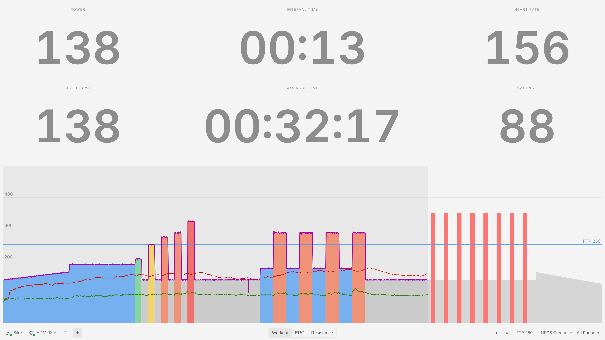
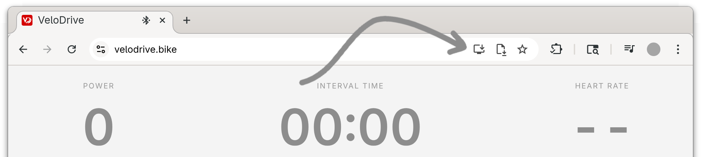
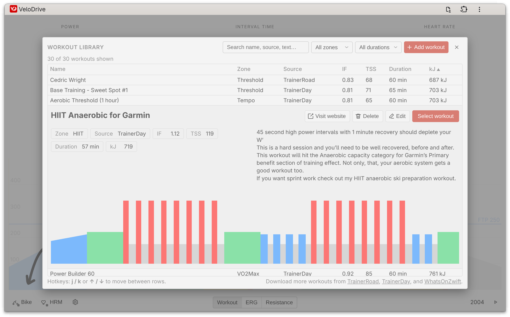

<p align="center">
  <a href="https://velodrive.bike/">
    
  </a>
</p>

# VeloDrive

VeloDrive is a lightweight **Progressive Web App (PWA)** for creating, organizing, and riding structured cycling workouts on FTMS-compatible smart trainers like the [Wahoo Kickr](https://www.wahoofitness.com/devices/indoor-cycling/bike-trainers) or [Tacx Neo](https://www.garmin.com/en-US/c/sports-fitness/indoor-trainers/)

You can open the app directly at:

👉 **https://velodrive.bike/**

The PWA works offline, installs locally, and runs entirely in the browser with no accounts or backend.

<picture>
  <source media="(prefers-color-scheme: dark)" srcset="media/screenshots/hero-dark.png">
  
</picture>

## Installation

Open:

**https://velodrive.bike/**

In **Google Chrome**, you’ll see an **Install** icon in the address bar.
Click it to install VeloDrive as an app. It will appear in your system’s app launcher and can run offline once installed.

<picture>
  <source media="(prefers-color-scheme: dark)" srcset="media/screenshots/install_dark.png">
  
</picture>

## Native Linux app (Flatpak)

A native Linux build (Tauri) is also available, hosting the same UI in a system
webview. Its main advantages over the PWA:

* **More reliable Bluetooth** — it talks to the trainer and heart-rate monitor through a native BlueZ connector (with remember-and-reconnect on launch), instead of the browser's Web Bluetooth, which is flakier and can't auto-reconnect.
* **Import from more sites** — workout-URL imports (e.g. **WhatsOnZwift** and TrainerDay) route through native HTTP, bypassing the browser CORS restrictions that block them in the PWA.

Build + install from this repo (needs `flatpak` + the GNOME runtime + `flatpak-builder`):

```sh
npm --prefix web run build
cargo build --release --manifest-path src-tauri/Cargo.toml
flatpak-builder --user --install --force-clean flatpak/build-dir flatpak/bike.velodrive.VeloDrive.yml
flatpak run bike.velodrive.VeloDrive
```

See [`flatpak/`](./flatpak) for packaging details.

## Features

* Import workouts by URL from TrainerDay or WhatsOnZwift, or bulk-import the original Zwift collection, TrainerDay's most popular, and the full WhatsOnZwift catalog
* Built-in workout builder, plus single- or multi-file `.zwo`/`.fit` upload (or drop files straight into the workouts folder)
* Folder-organized library with zone/duration filters + search, and a quick zone/duration workout switcher (← / → to step) right on the ride screen
* Compute IF, TSS, kJ, and structured interval summaries (free rides count as 50% FTP and group under a dedicated Freeride zone)
* Local workout library via the File System Access API
* Bluetooth FTMS trainer control + heart-rate support
* Real-time workout view with ERG/resistance modes
* Local FIT workout history + calendar planner
* Works fully offline as a PWA

<picture>
  <source media="(prefers-color-scheme: dark)" srcset="media/screenshots/selector-dark.png">
  
</picture>

## Platform support

Runs in Google Chrome on:

* Linux (primary target)
* Windows
* macOS
* ChromeOS
* Android

iOS Safari does not support the required APIs.

## Trainer compatibility

Uses standard Bluetooth FTMS and HR services.

Tested with:

* Wahoo KICKR
* Wahoo TICKR

Should work with most FTMS-compatible trainers (Tacx, Elite, Saris, JetBlack, etc.).

## Development

VeloDrive is built with **TypeScript, Vite, and Svelte 5**. The source lives in
[`web/`](./web); the production build is published to [`docs/`](./docs), which is
the GitHub Pages source for velodrive.bike. See [`web/README.md`](./web/README.md)
for the architecture and test harness.

```sh
cd web
npm install
npm run dev            # local dev server
npm run typecheck      # tsc --noEmit (strict)
npm run test           # unit tests (vitest)
npx playwright install chromium
npm run test:e2e       # end-to-end tests (Playwright)
npm run build:docs     # build the PWA into ../docs
```

## Contributing

Contributions are welcome — especially from people building a bank of **ZWO workouts and training plans**.

Refactors, device support, and UX improvements are also meaningful contributions.

## License

MIT
