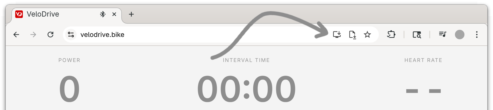
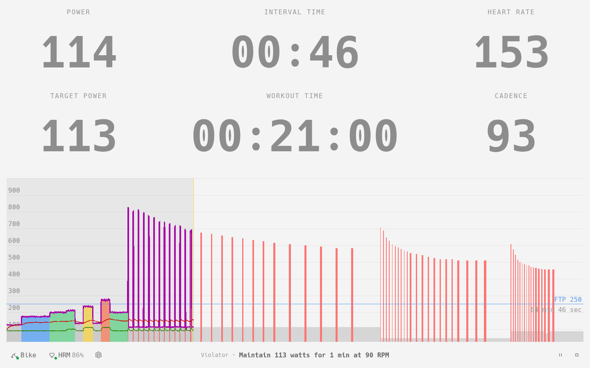
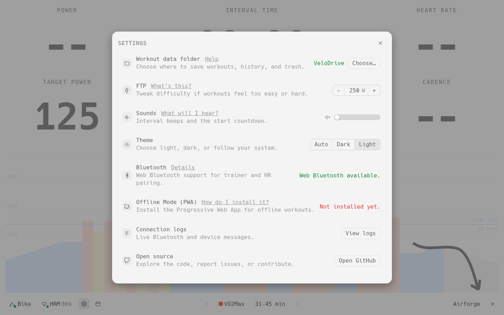
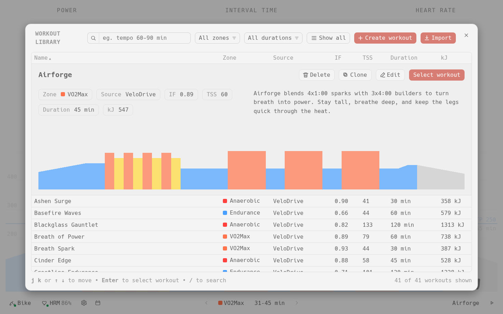
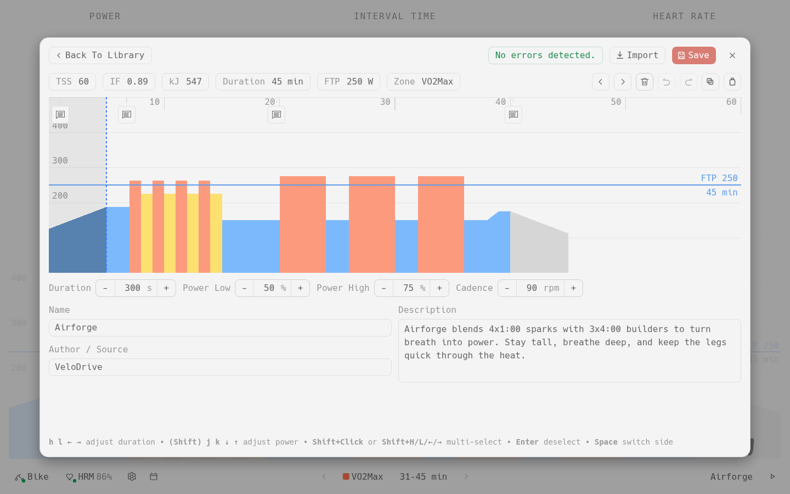
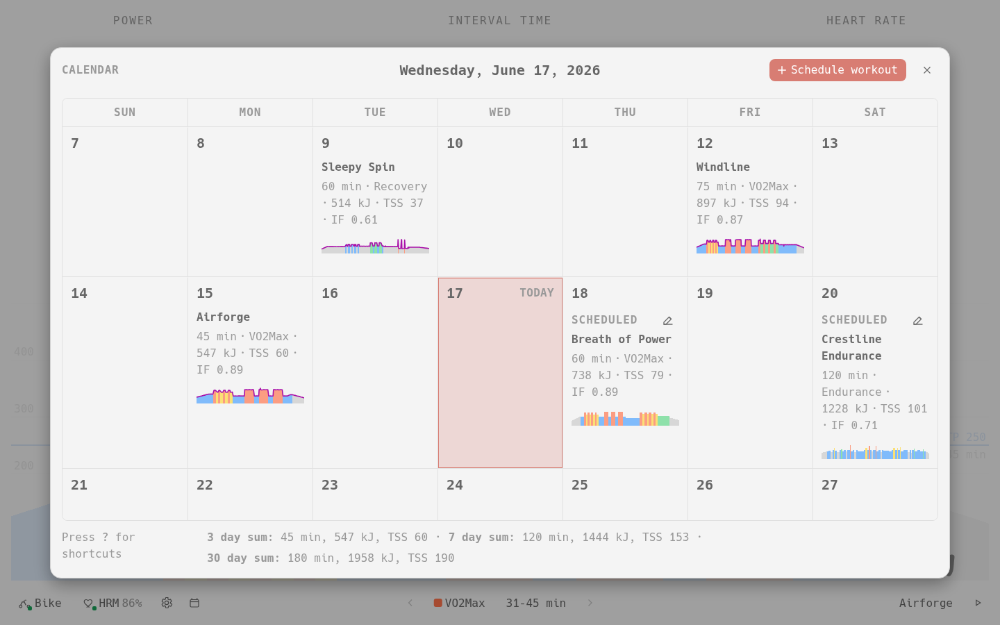
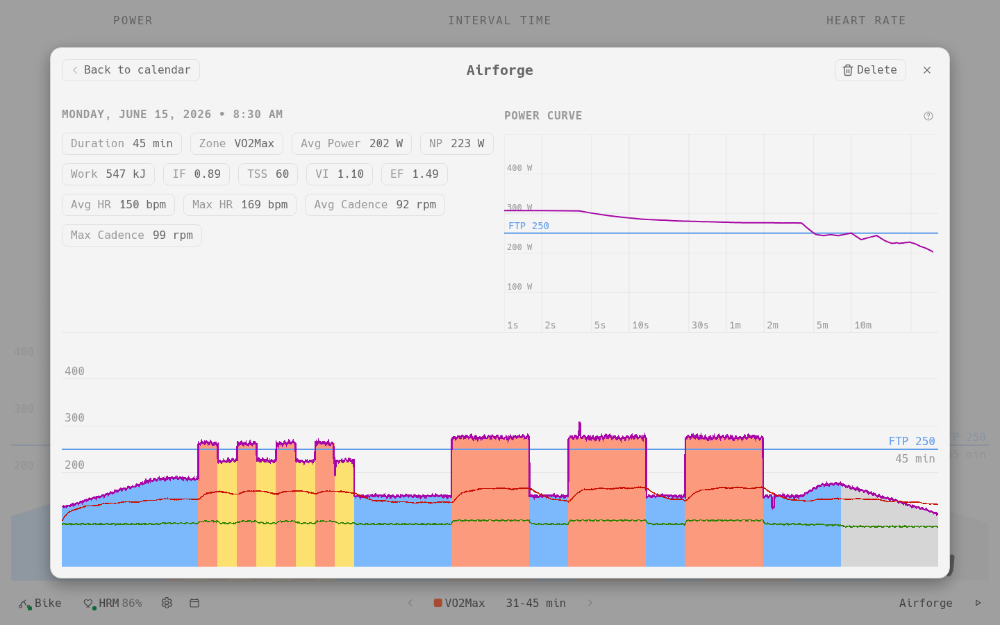

<p align="center">
  <a href="https://velodrive.bike/">
    
  </a>
</p>

# VeloDrive

VeloDrive is a private, local app for building and riding structured workouts on any FTMS smart trainer, like the [Wahoo KICKR](https://www.wahoofitness.com/devices/indoor-cycling/bike-trainers) or [Tacx NEO](https://www.garmin.com/en-US/c/sports-fitness/indoor-trainers/). It runs entirely on your computer in [Google Chrome](https://www.google.com/chrome/) or as a [native Linux app](#native-linux-app-flatpak)—no account, and no workout or ride data is uploaded.

Click here to start riding 👉 **https://velodrive.bike/**

## Install the Chrome App

If you install it as a Chrome app, you can ride offline.

1. Open <https://velodrive.bike/> in Chrome.
2. Click the install icon in the address bar.

<picture>
  <source media="(prefers-color-scheme: dark)" srcset="media/screenshots/install_dark.png">
  
</picture>

## Feature tour

### Stay on target while riding

See real-time information at a glance, in a simple, distraction-free workout view.

<picture>
  <source media="(prefers-color-scheme: dark)" srcset="media/screenshots/guide/ride-violator-dark.png">
  
</picture>

### Connect over Bluetooth

VeloDrive works with most modern Bluetooth smart trainers such as the [Wahoo KICKR](https://www.wahoofitness.com/devices/indoor-cycling/bike-trainers) and [Garmin Tacx NEO](https://www.garmin.com/en-US/c/sports-fitness/indoor-trainers/) through the standard FTMS protocol and records heart rate from an optional Bluetooth monitor.

<picture>
  <source media="(prefers-color-scheme: dark)" srcset="media/screenshots/guide/settings-dark.png">
  
</picture>

### Find the right workout

Velodrive comes with a large number of built-in workouts, but you may also import existing workouts or build your own.

<picture>
  <source media="(prefers-color-scheme: dark)" srcset="media/screenshots/guide/library-airforge-dark.png">
  
</picture>

### Import or build workouts

VeloDrive is compatible with the `.zwo` and `.fit` protocols, meaning you can import any workout from websites like [TrainerDay](https://app.trainerday.com/search?sortBy=popularity), [the Zwift collection](https://forums.zwift.com/t/workout-refresh-october-2023/609799), and [WhatsOnZwift](https://whatsonzwift.com/workouts).

<picture>
  <source media="(prefers-color-scheme: dark)" srcset="media/screenshots/guide/builder-airforge-dark.png">
  
</picture>

You can also use the built-in workout builder to create or edit your own.

### Plan the week

Using the workout calendar to view your past workouts, or schedule ones for the future. 3/7/30 day stats are automcatically calculated for your scheudle, so you can keep your TSS in check.

<picture>
  <source media="(prefers-color-scheme: dark)" srcset="media/screenshots/guide/calendar-training-week-dark.png">
  
</picture>

### Understand the ride

All workouts are saved at FIT files to your hard drive, so you can analyze them whenever you want, or even upload them to apps like [Intervals.icu](https://intervals.icu/) or [Strava](https://www.strava.com/upload/select).

<picture>
  <source media="(prefers-color-scheme: dark)" srcset="media/screenshots/guide/history-airforge-dark.png">
  
</picture>

## Your data

Your workouts and ride files stay in the folder you choose, where you can inspect, back up, or move them yourself:

- `workouts/` holds your workout library
- `history/` holds completed rides as FIT files
- `trash/` holds workouts and rides removed through the app

Items in `trash` remain available until you decide to remove them permanently.

## Shortcuts

| Key | Action |
| --- | --- |
| `Space` | Start, pause, or resume the selected workout |
| `W` | Open the workout library |
| `C` | Open the calendar |
| `S` | Open Settings |
| `E` / `R` | Choose ERG or resistance during a free-ride block |
| `J` / `K` | Lower or raise the active free-ride target |
| `Esc` | Close the current view or return to its parent |

## Native Linux app (Flatpak)

Linux users can build the native app for more reliable Bluetooth connections and automatic device reconnection. It can also import workout links that browsers block:

```sh
scripts/build-flatpak.sh          # build and install
scripts/build-flatpak.sh --run    # build, install, and launch
flatpak run bike.velodrive.VeloDrive
```

See [flatpak/README.md](flatpak/README.md) for prerequisites and packaging details.

## Device support

VeloDrive works with Bluetooth FTMS trainers and standard Bluetooth heart-rate monitors. It has been tested with a Wahoo KICKR and Wahoo TICKR, and other standards-compliant devices should work too.

## Development

The app is built with TypeScript, Vite, and Svelte. The source is in [web/](web/), and the GitHub Pages build is in [docs/](docs/). See [web/README.md](web/README.md) for architecture and test-harness details.

```sh
cd web
npm install
npm run typecheck
npm run test
npm run test:e2e
```

## Contributing

Contributions to the workout bank, device support, tests, documentation, and interface are welcome.

## License

[MIT](LICENSE)
